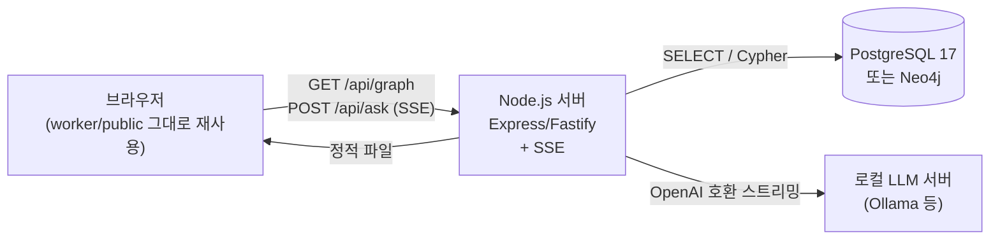

# 로컬 호스팅 + PostgreSQL 17 / Neo4j 포팅 가이드

현재 배포(https://threegpp-rf-graph.min-rf.workers.dev )는 Cloudflare Workers + KV + Workers AI 기반이다.
이 문서는 **Cloudflare 없이 로컬(또는 자체 서버)에서** 같은 대시보드를 운영한다고 가정할 때,
그래프 저장소를 **PostgreSQL 17** 또는 **Neo4j**로 바꾸려면 무엇을 바꿔야 하는지 정리한 설계 문서다.
실제 코드 변경은 포함하지 않으며, 포팅 시 참고할 스키마·쿼리·아키텍처를 기록한다.

## 1. 현재 아키텍처 요약

| 구성 요소 | 현재(Cloudflare) | 역할 |
|---|---|---|
| 정적 자산 서빙 | Workers Static Assets (`env.ASSETS`) | `worker/public/*` (index.html, app.js, styles.css) |
| API 라우팅 | `worker/src/index.ts`의 `fetch` 핸들러 | `/api/graph`, `/api/ask` |
| 그래프 저장 | Cloudflare KV, 단일 키 `graph:v1`에 `{nodes, edges}` JSON blob | `worker/src/lib/graphStore.ts` |
| 검색/서브그래프 추출 | 매 요청마다 KV에서 전체 그래프를 읽어 메모리에서 키워드 매칭 + N-hop BFS | `worker/src/lib/retrieval.ts` |
| LLM | Workers AI (`@cf/google/gemma-4-26b-a4b-it`), OpenAI 호환 스트리밍 응답 | `worker/src/api/ask.ts` |
| 배포 인프라 | `wrangler deploy`, KV 네임스페이스, AI 바인딩 | `wrangler.toml` |

핵심 관찰: **그래프가 232 노드/347 엣지 수준으로 작아서, 지금 구조는 사실상 "KV에 저장된 JSON을 매번 통째로 읽어 메모리에서 그래프 알고리즘을 돌리는" 방식**이다. DB로 옮긴다는 것은 이 메모리 연산(키워드 검색, N-hop 서브그래프 추출)을 DB 쿼리로 대체하는 것을 의미한다.

## 2. 컴포넌트 치환 매핑

| Cloudflare 구성 요소 | 로컬 대체재 |
|---|---|
| Workers 런타임 | Node.js + Express(또는 Fastify) HTTP 서버 |
| Workers Static Assets | `express.static('public')` 또는 Nginx로 `worker/public` 서빙 |
| Cloudflare KV | PostgreSQL 17 **또는** Neo4j |
| Workers AI | 로컬 LLM 서버 — **Ollama**(OpenAI 호환 `/v1/chat/completions`) 또는 자체 vLLM/LM Studio |
| `wrangler secret` | `.env` + dotenv (DB 접속정보, LLM 엔드포인트) |
| `wrangler deploy` | `docker compose up` 또는 `pm2` / `systemd` 서비스 등록 |

전체 구조는 아래처럼 바뀐다.



프론트엔드(`worker/public/app.js`, `index.html`, `styles.css`)는 **동일 오리진에서 같은 API 경로(`/api/graph`, `/api/ask`)를 그대로 호출**하도록 서버만 구현하면 수정이 거의 필요 없다.

## 3. DB 선택: PostgreSQL 17 vs Neo4j

| 기준 | PostgreSQL 17 | Neo4j |
|---|---|---|
| 데이터 모델 적합성 | 관계형 테이블 2개(nodes/edges)로 표현, JOIN 기반 | 네이티브 그래프 — 노드/관계가 1급 개념, 모델이 곧 스키마 |
| N-hop 서브그래프 추출 | 재귀 CTE(`WITH RECURSIVE`)로 구현 가능하지만 SQL이 다소 장황 | `MATCH (n)-[*1..2]-(m)` 한 줄로 표현, 가장 자연스러움 |
| 키워드 검색 | `pg_trgm` + GIN 인덱스, 또는 `tsvector` 전문 검색 | 내장 전문 검색 인덱스(`db.index.fulltext`) |
| 향후 임베딩 검색(Vectorize 대체) | `pgvector` 확장으로 매끄럽게 확장 가능 | Neo4j 5.x 벡터 인덱스로 가능(운영 경험 필요) |
| 운영/러닝커브 | 대부분의 백엔드 개발자에게 익숙, 툴 생태계 풍부 | Cypher 문법을 새로 배워야 함, 그래프 특화 사고 필요 |
| 이 프로젝트 규모(232 노드) | 인덱스 없이도 충분히 빠름 | 마찬가지로 여유 있음 — 규모가 병목이 되진 않음 |
| `docs/roadmap.md`의 향후 확장(디바이스 인스턴스 레이어, 다층 그래프) | 관계형으로도 가능하나 레이어가 늘수록 JOIN이 복잡해짐 | 새 노드 타입/관계 타입 추가가 스키마 변경 없이 자연스러움 |

**권장**: 그래프 순회(`explained_by`/`causes`로 이어지는 인과 체인)가 이 서비스의 핵심 가치이므로 **개념적으로는 Neo4j가 더 잘 맞는다.** 다만 소규모 실습/1인 운영이고 SQL 경험이 이미 있다면 **PostgreSQL 17 + 재귀 CTE**로도 충분히 구현 가능하고 운영 부담이 적다. 아래에 두 방식을 모두 정리하니 팀/개인 상황에 맞게 선택한다.

## 4-A. PostgreSQL 17로 포팅

### 스키마

```sql
CREATE TABLE nodes (
  id           TEXT PRIMARY KEY,
  type         TEXT NOT NULL CHECK (type IN ('Procedure','Message','Parameter','Formula','Symptom','Implementation')),
  layer        TEXT NOT NULL CHECK (layer IN ('base','application','vendor')),
  name_ko      TEXT NOT NULL,
  name_en      TEXT NOT NULL,
  description  TEXT NOT NULL,
  spec_ref     TEXT,
  verified     BOOLEAN NOT NULL DEFAULT false,
  flow         TEXT,
  search_vec   TSVECTOR GENERATED ALWAYS AS (
                 to_tsvector('simple', coalesce(name_ko,'') || ' ' || coalesce(name_en,'') || ' ' || coalesce(description,''))
               ) STORED
);

CREATE TABLE edges (
  id        TEXT PRIMARY KEY,
  from_id   TEXT NOT NULL REFERENCES nodes(id) ON DELETE CASCADE,
  to_id     TEXT NOT NULL REFERENCES nodes(id) ON DELETE CASCADE,
  relation  TEXT NOT NULL CHECK (relation IN
              ('contains','triggers','uses_parameter','computed_by','affects','causes','explained_by','mitigated_by')),
  note      TEXT
);

CREATE INDEX idx_edges_from ON edges(from_id);
CREATE INDEX idx_edges_to   ON edges(to_id);
CREATE INDEX idx_nodes_search ON nodes USING GIN(search_vec);
```

`GENERATED ALWAYS AS ... STORED` 컬럼은 PostgreSQL 12+에서 지원되며 17에서도 그대로 사용 가능. 한국어 형태소 분석이 필요하면 `simple` 대신 `pg_bigm`/`mecab` 확장을 검토(선택 사항 — 지금의 `retrieval.ts`도 단순 부분 문자열 매칭 수준이라 `simple` + `ILIKE` 조합으로도 동등한 수준은 나온다).

### `GET /api/graph` (전체 그래프)

```sql
SELECT id, type, layer, name_ko, name_en, description, spec_ref AS "specRef", verified, flow FROM nodes;
SELECT id, from_id AS "from", to_id AS "to", relation, note FROM edges;
```
두 결과를 서버에서 `{nodes, edges}`로 합쳐 반환 — API 응답 포맷은 지금과 동일하게 유지 가능.

### `searchNodes` 대체 (키워드 검색)

```sql
SELECT id, type, layer, name_ko, name_en, description, spec_ref AS "specRef"
FROM nodes
WHERE search_vec @@ plainto_tsquery('simple', $1)
   OR name_ko ILIKE '%' || $1 || '%'
   OR name_en ILIKE '%' || $1 || '%'
ORDER BY ts_rank(search_vec, plainto_tsquery('simple', $1)) DESC
LIMIT 8;
```
지금의 `retrieval.ts`는 질문을 토큰화해 토큰별로 매칭하는 방식이라, 완전히 동일한 동작을 원하면 애플리케이션 레이어에서 질문을 토큰화한 뒤 `tsquery`를 `token1 | token2 | ...` 형태로 조립해서 넘긴다.

### `expandSubgraph` 대체 (N-hop 서브그래프, 재귀 CTE)

```sql
WITH RECURSIVE sub(id, depth) AS (
  SELECT unnest($1::text[]), 0            -- $1 = seed id 배열
  UNION
  SELECT e.to_id, s.depth + 1
  FROM edges e JOIN sub s ON e.from_id = s.id
  WHERE s.depth < $2                       -- $2 = hop 수 (2)
  UNION
  SELECT e.from_id, s.depth + 1
  FROM edges e JOIN sub s ON e.to_id = s.id
  WHERE s.depth < $2
)
SELECT DISTINCT n.* FROM nodes n JOIN sub s ON n.id = s.id;
```
엣지도 `sub`에 포함된 id 쌍으로 다시 필터링해서 함께 반환한다.

### 시드 데이터 마이그레이션

`data/seed-nodes.json` / `seed-edges.json`을 그대로 COPY로 적재할 수 있다.

```bash
# Node.js 스크립트로 JSON -> CSV 변환 후
psql -d threegpp -c "\copy nodes(id,type,layer,name_ko,name_en,description,spec_ref,verified,flow) FROM 'nodes.csv' CSV HEADER"
psql -d threegpp -c "\copy edges(id,from_id,to_id,relation,note) FROM 'edges.csv' CSV HEADER"
```
또는 Node 스크립트에서 `pg` 드라이버로 JSON을 직접 읽어 `INSERT ... ON CONFLICT (id) DO UPDATE`로 upsert(현재 `data/seed-*.json`이 source of truth이므로, 배포 스크립트는 "JSON을 읽어 DB에 동기화"하는 형태를 유지).

## 4-B. Neo4j로 포팅

### 제약조건/인덱스

```cypher
CREATE CONSTRAINT node_id_unique IF NOT EXISTS FOR (n:Node) REQUIRE n.id IS UNIQUE;
CREATE FULLTEXT INDEX nodeSearch IF NOT EXISTS FOR (n:Node) ON EACH [n.name_ko, n.name_en, n.description];
```
노드 타입(Procedure/Message/...)은 Neo4j 관례상 **레이블**로 표현할 수도 있지만(`:Procedure`, `:Symptom` 등), 지금 스키마처럼 "타입"이 검색/필터 대상 속성으로도 쓰이므로 **`:Node` 레이블 하나 + `type` 속성**을 유지하는 편이 현재 프론트엔드(범례 필터가 `type` 문자열 기준)와 1:1로 대응되어 더 단순하다.

### 노드/관계 적재 (Cypher, `apoc.load.json` 또는 드라이버 스크립트)

```cypher
CALL apoc.periodic.iterate(
  "CALL apoc.load.json('file:///seed-nodes.json') YIELD value RETURN value.nodes AS nodes UNWIND nodes AS n RETURN n",
  "MERGE (x:Node {id: n.id})
   SET x.type = n.type, x.layer = n.layer, x.name_ko = n.name_ko, x.name_en = n.name_en,
       x.description = n.description, x.specRef = n.specRef, x.verified = coalesce(n.verified,false), x.flow = n.flow",
  {batchSize: 100}
);
```
엣지는 `relation`을 관계 타입으로 직접 쓰거나(`MERGE (a)-[:CAUSES]->(b)`), 지금처럼 관계 종류가 8개로 고정되어 있어 프론트엔드/백엔드가 문자열 그대로 다루는 점을 고려하면 **관계 타입 자체를 `relation` 속성값으로 매핑해 단일 관계 타입 `:REL {relation, note}`로 통일**하는 것이 App 코드 변경을 최소화한다(둘 다 가능 — 순수 그래프스러움을 원하면 관계 타입 분리 권장).

```cypher
MERGE (a:Node {id: edge.from})
MERGE (b:Node {id: edge.to})
MERGE (a)-[r:REL {id: edge.id}]->(b)
SET r.relation = edge.relation, r.note = edge.note;
```

### `GET /api/graph`

```cypher
MATCH (n:Node) RETURN n;
MATCH (a:Node)-[r:REL]->(b:Node) RETURN r.id AS id, a.id AS from, b.id AS to, r.relation AS relation, r.note AS note;
```

### `searchNodes` 대체

```cypher
CALL db.index.fulltext.queryNodes('nodeSearch', $query) YIELD node, score
RETURN node ORDER BY score DESC LIMIT 8;
```
`$query`는 지금의 토큰화 로직을 그대로 살려 `"token1 OR token2 OR ..."` 형태의 Lucene 쿼리 문자열로 조립.

### `expandSubgraph` 대체 (N-hop)

```cypher
MATCH (seed:Node) WHERE seed.id IN $seedIds
MATCH path = (seed)-[:REL*1..2]-(neighbor:Node)
WITH collect(DISTINCT seed) + collect(DISTINCT neighbor) AS ns, collect(DISTINCT relationships(path)) AS rss
UNWIND ns AS n
WITH collect(DISTINCT n) AS nodes, rss
UNWIND rss AS rs
UNWIND rs AS r
RETURN nodes, collect(DISTINCT r) AS edges;
```
`[:REL*1..2]`가 2-hop 서브그래프 추출을 그대로 표현 — 지금 `retrieval.ts`의 BFS 루프보다 훨씬 짧다. (실무에서는 `apoc.path.subgraphAll(seed, {maxLevel:2})`를 쓰면 더 간결.)

## 5. 백엔드 서버 포팅 (Node.js/Express 예시, DB 무관 공통 부분)

```js
// server.js (개념 스켈레톤 — 실제 이식 시 참고용)
import express from 'express';
import { Pool } from 'pg';           // 또는 neo4j-driver
const app = express();
app.use(express.json());
app.use(express.static('public'));   // worker/public을 그대로 복사

app.get('/api/graph', async (req, res) => {
  const graph = await loadFullGraph();      // DB별 구현체로 교체
  res.json(graph);
});

app.post('/api/ask', async (req, res) => {
  res.writeHead(200, {
    'Content-Type': 'text/event-stream; charset=utf-8',
    'Cache-Control': 'no-cache, no-transform',
    Connection: 'keep-alive',
  });
  const send = (payload) => res.write(`data: ${JSON.stringify(payload)}\n\n`);
  // ask.ts의 로직(seed 검색 -> subgraph 추출 -> systemPrompt 조립 -> LLM 스트리밍)을
  // Workers 전용 API(env.AI.run, TransformStream) 대신 Node 표준 API로 그대로 옮기면 됨.
  // ...
  res.end();
});

app.listen(process.env.PORT || 8787);
```

핵심은 **`ask.ts`의 비즈니스 로직(질문 → seed 검색 → subgraph 추출 → systemPrompt 조립 → suggestions 생성 → SSE 전송)은 DB/런타임과 무관하게 거의 그대로 재사용 가능**하고, 바뀌는 부분은 딱 두 곳이다.

1. `getGraph`/`searchNodes`/`expandSubgraph` 구현체 — KV+메모리 연산 → 위 4-A/4-B의 DB 쿼리로 교체
2. `env.AI.run(...)` 호출부 — 로컬 LLM 서버로의 HTTP 스트리밍 호출로 교체 (아래 6절)

## 6. LLM 로컬 대체 (Workers AI → Ollama)

- Ollama는 OpenAI 호환 엔드포인트(`POST http://localhost:11434/v1/chat/completions`)를 제공하므로, 현재 `ask.ts`가 이미 파싱하고 있는 `choices[0].delta.content` / `data: {...}\n\n` SSE 포맷과 **형태가 거의 동일**하다.
- 모델은 `gemma3` 계열(예: `gemma3:27b` 또는 로컬 GPU 사양에 맞는 크기)이나 한국어 성능이 검증된 다른 모델로 교체.
- `reasoning_content` 필드는 모델에 따라 없을 수 있으므로 옵셔널 처리(현재 코드도 이미 옵셔널 체이닝으로 처리되어 있어 그대로 호환).
- 예시 호출:
  ```js
  const r = await fetch('http://localhost:11434/v1/chat/completions', {
    method: 'POST',
    headers: { 'Content-Type': 'application/json' },
    body: JSON.stringify({ model: 'gemma3:27b', messages: aiMessages, stream: true }),
  });
  const reader = r.body.getReader(); // 이후 파싱 로직은 ask.ts와 동일
  ```

## 7. 환경 변수 / 설정 매핑

| Cloudflare | 로컬 |
|---|---|
| `wrangler.toml`의 `[[kv_namespaces]]` | `.env`의 `DATABASE_URL=postgres://...` 또는 `NEO4J_URI=bolt://localhost:7687` |
| `wrangler.toml`의 `[ai]` 바인딩 | `.env`의 `LLM_BASE_URL=http://localhost:11434/v1`, `LLM_MODEL=gemma3:27b` |
| `[assets] directory = "./public"` | `express.static(path.join(__dirname, 'public'))` |

## 8. Docker Compose 예시 (PostgreSQL 버전)

```yaml
services:
  db:
    image: postgres:17
    environment:
      POSTGRES_DB: threegpp
      POSTGRES_PASSWORD: changeme
    ports: ["5432:5432"]
    volumes: ["pgdata:/var/lib/postgresql/data"]
  ollama:
    image: ollama/ollama
    ports: ["11434:11434"]
    volumes: ["ollama:/root/.ollama"]
  app:
    build: ./server
    environment:
      DATABASE_URL: postgres://postgres:changeme@db:5432/threegpp
      LLM_BASE_URL: http://ollama:11434/v1
    ports: ["8787:8787"]
    depends_on: [db, ollama]
volumes:
  pgdata:
  ollama:
```
Neo4j로 갈 경우 `db` 서비스만 `neo4j:5` 이미지(`NEO4J_AUTH`, 포트 7474/7687)로 바꾸면 된다.

## 9. 마이그레이션 체크리스트

- [ ] DB 선택 확정 (PostgreSQL 17 권장 — 운영 부담 적음 / Neo4j — 그래프 순회가 핵심 가치일 때)
- [ ] 스키마 생성 (4-A 또는 4-B)
- [ ] `data/seed-nodes.json` + `seed-edges.json` → DB 적재 스크립트 작성 (source of truth는 계속 JSON 파일로 유지하고, DB는 "빌드 결과물"로 취급 — 지금 KV와 동일한 철학)
- [ ] Node.js 서버로 `/api/graph`, `/api/ask` 포팅 (`retrieval.ts`의 로직을 DB 쿼리로 교체, `ask.ts`의 systemPrompt/SSE 로직은 그대로 재사용)
- [ ] `worker/public/*`을 서버의 정적 파일 루트로 복사 (app.js는 API 경로가 같으므로 수정 불필요, 관리자 UI는 이미 제거된 상태라 이식 대상 없음)
- [ ] 로컬 LLM(Ollama 등) 설치 및 모델 스트리밍 응답 포맷 재확인
- [ ] `.env` 기반 설정으로 전환, Cloudflare 전용 코드(`Env` 인터페이스의 `KVNamespace`/`Ai`/`Fetcher` 타입, `wrangler.toml`) 제거
- [ ] Docker Compose로 DB+LLM+서버 통합 기동 검증
- [ ] 그래프 연결성/노드 수 검증 (`SELECT count(*)` 또는 `MATCH (n) RETURN count(n)`이 232와 일치하는지)
